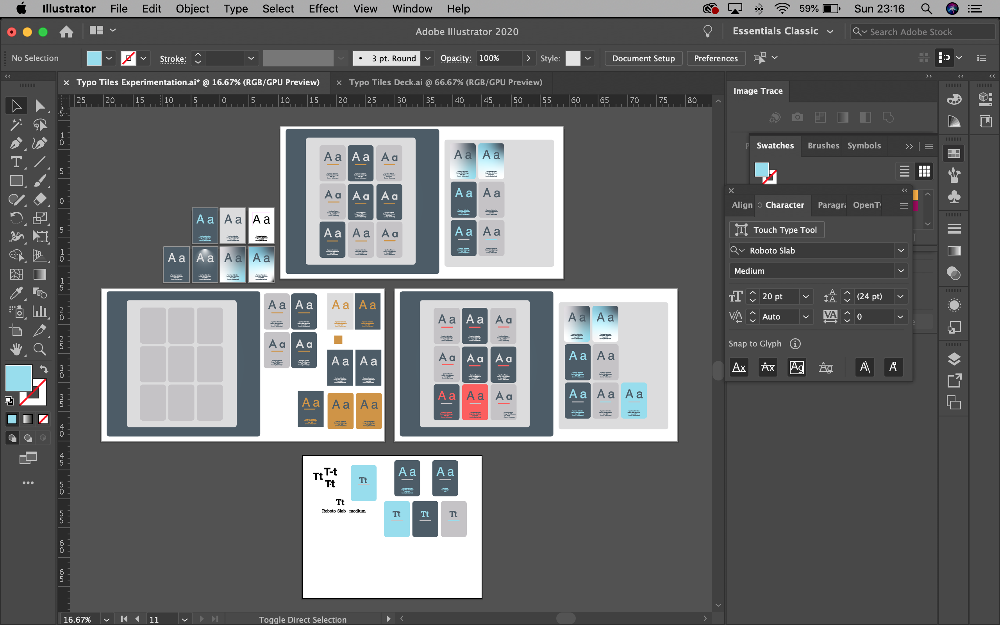

# Typo-tiles

[Visit the Typo-tiles Game site here](https://roxjade.github.io/typo-tiles/)

Typo-tiles is a card matching game based on matching a selection of iconic typefaces. It's a short game designed to be fun and informative. 
As with any card-matching game, the idea is to match the two typefaces until all cards are matched.
Taking inspiration from
[The Type Kerning Game](https://type.method.ac/) and [Type War](http://typewar.com/), the game has been designed as a starter learning activity aimed primarily at students or anyone who wishes to learn more about typography. As well as the typeface sample 'A a' on each card, 
there is also a starting point of information for the player to use as a prompt or starting point for further research into each typeface. 

Typo-tiles has been created with HTML, CSS and Javascript. It is responsive on multiple screen sizes mobile, tablet and desktop. It's most effective to play on tablet screen sizes and above.

# Contents
1. [UX](#UX)
2. [Wireframes, Mockups and Design](#Wireframes,-Mockups-and-Design)
3. [Features](#Features)
4. [Technologies Used](#Technologies-used)
5. [Credits](#Credits)

Testing can be found in a separate file:
[Testing](#/TESTING.md)

# UX

## User

Coming from a teaching background in graphic design, I always found it useful to start lessons with a game/starter activity to engage learners. 
With this in mind, I created 'Typo-tiles', specifically aimed at learners to act as a fun starter activity when learning about typography, typefaces and fonts. 
Although it is aimed at young adults, it can be applicable to anyone who wishes to access it as a typography learning resource.
Within the deck there can be a found a selection of pairs displaying some of the most iconic typefaces and font families/styles, 
allowing the user a strong starting point if they were to use the cards as an educational prompt for research. For learners who study graphic design, it is essential  
to build an awareness of typography and the fonts in the game. It's also important to be able to identify minor differences in similar typefaces. 
Therefore, some of the cards feature similar fonts to increase the challenge.

## User stories

1. As a user, I want to engage in a short game that provides fun and a sense of challenge.
2. As a user, I want to build familiarity with a range of iconic typeface samples and a short amount of information on each.
3. As a user, I may wish to make note of each typeface to research into further.
4. As a user, I want to be told what my score or rating is at the end of the game.
5. As a returning user, I want to be able to achieve a better score or rating next time.
6. As a user, I want to be able play a fluid game with a clean, appealing design aesthetic.
7. As a teacher, I would like to use the game as a quick starter activity to engage learners and introduce them to a range of funcdamental typefaces in graphic design.

## Scope

Based on the information gathered about the user and user stories, this project should include, a simple, fun game that's informative and responsive across devices. 
Users will expect a fluidity in the functionality of the game. A quick loading and game restart speed and professional presentation of the game. 

## Structure & Skeleton

For the game, the structure will be limited to a one-page site. It will include:

- A logo/title
- A deck of cards laid out in a grid, (I'll start by experiemnting with 16 cards and see what kind of grid is most appropriate).
- A timer, rating system and restart button
- A pop-up 'congratulations/completed' modal 

Users should expect a modern presentation of the game, therefore, I researched colour palette's on [Coolers](https://coolors.co/). 
I wanted the site to remain fairly neutral using greys, with a pop of brighter colour to liven it up. 

## Surface design

I started designing the wireframes with a clear vision of layout, typefaces, colour palette and features. To create the appearance of modern presentation, 
I want to:

- Add subtle gradient to create a slight sense of depth to the card board
- Add rounded edge's to to all shapes (cards & buttons)
- Include a smaple of the typeface on each card with a small amount of information beneath
- Keep the page layout simple, with minimal information. 
- Dependant on screen size, the game fit's to the size of the screen, changing the layout of the card deck, without losing resolution

# Wireframes, Mockups and Design

I developed a series of mockups, colour palettes and card designs in Adobe Illustrator.
Initially, I wanted to add more information to the cards, but I had to consider how to maintain the responsiveness on smaller screen sizes. 
After testing the mockup's at different screen sizes, I concluded that less information was more legible on smaller screens. 
 

# Features

1. Card deck (face down) - users can click two cards to flip them over, compare them, if there's a match, they'll remain flipped, if not, they'll turn back face down.
2. The event of clicking on a card will start the timer and a move counter above the board.
3. Upon 24 card clicks, the 'stars rating' above the card deck will reduce from 3 to 2.
4. Upon 32 card clicks, the 'stars rating' will reduce from 2 to 1.
5. A button can be located beneath the center of the deck - 'Back to start', this resets the game, shuffle's the cards and resets all timers, move counters and stars.
6. Once all cards have been matched, a modal will pop-up indicating completion of the game, it will report the moves made, duration of time and a star rating.
7. Upon closing the modal, the game will be reset.

The game is fully responsive for all screen sizes but is best playable on a larger screen to avoid scrolling around for cards. 
I wanted to avoid decreasing the size of the cards for smaller screen sizes because this would reduce legibility. 
I designed the deck in Adobe Illustrator because I wanted the card 'images' to be SVG's. This means the card deck won't lose any resolution quality and the file sizes are very small, 
allowing the game and the functionality to load and run quickly for the user. 
I started the Javascript code by following an online tutorial by [Marina Frerreira](https://www.youtube.com/watch?v=eMhiMsEC9Uk&list=PLLX1I3KXZ-YH-woTgiCfONMya39-Ty8qw). I used this to get started and adapted it with my own deisgn and added functionality.

## Additional considerations and features to implement in the future

1. Add 2 levels to the game, providing additional challenge and progression. I'd do this by adding more rows of card pairs. With this, I'd also increase the amount of stars from 3 to 5.
This was something I originally wanted to include in the game. With more time and research, this is something I will implement in the future. 
2. Add a local storage fucntion to preserve user's personal scores to beat in the future. This was something I also wanted to implement and will work on adding in the future.
3. Add links to the flipped cards to direct the user  to additional information on the typefaces/font. I would add a click event function for this, upon matching 2 cards. This could allow the user to access more information about the typefaces if they wanted. 

# Technologies Used

- [Adobe Illustrator](https://www.adobe.com/uk/products/illustrator.html) Used for creating the card deck - front and backs. Also, the deisgn and mockups. (All card deck typefaces were from Adobe Illustrator).
- [Gitpod and Github](https://github.com/RoxJade/typo-tiles) All code and files created in Gitpod, repository in Github, site published and hosted in Github pages.
- HTML, used to create the main page and pop-up modal.
- CSS, used to style the project and make it responsive.
- Javascript - 'vanilla Javascript' used to create the game functionality, no additonal Javascript libraries used.
- [Google fonts](https://fonts.google.com/specimen/Roboto+Slab?preview.text_type=custom) Roboto Slab typeface used for the Logo and font throughout the project. 
- [Font Awesome](https://fontawesome.com/) Used to add the 'star' icons for the rating system.

# Credits
## Content
The design of the site was created by myself. I started the Javascript code by following an online tutorial by [Marina Frerreira](https://www.youtube.com/watch?v=eMhiMsEC9Uk&list=PLLX1I3KXZ-YH-woTgiCfONMya39-Ty8qw).
Further research included watching a series of tutorials and reading through many different resources, game code examples, tutorials with my Mentor and thoroughly recapping the Code Institute Javascript Essentials module. 
This helped to familiarise me with Javascript code, functions and the syntax, which I found very challenging in this project and required a lot of additional research before I started to feel comfortable with the code.
A list of the resources are below:

## Javascript resources and research
- [Code Institute - Javascript Essentials Module](https://courses.codeinstitute.net/courses/course-v1:CodeInstitute+JSF101+2017_T1/info)
- [Marina Frerreira - How to create a pair matching game](https://www.youtube.com/watch?v=eMhiMsEC9Uk&list=PLLX1I3KXZ-YH-woTgiCfONMya39-Ty8qw)
- [Free Frontend - 14 examples of Javascript pairs games](https://freefrontend.com/javascript-memory-games/)
- [Port EXE - How to create the Javascript for a spooky pair matching game](https://www.youtube.com/watch?v=3uuQ3g92oPQ&t=0s)
- [Sandra Israel - How to build a memory game in Javascript tutorial](https://scotch.io/tutorials/how-to-build-a-memory-matching-game-in-javascript)
- [Ania Kubow - Building 7 games with Javascript](https://www.youtube.com/watch?v=lhNdUVh3qCc&t=1128s)
- [Adam Khoury - Programming a pairs game in Javascript](http://www.developphp.com/video/JavaScript/Memory-Game-Programming-Tutorial)
- [Code Mentor - How to create a counter in Javascript](https://www.codementor.io/@jamesezechukwu/how-to-create-a-simple-counter-using-javascript-html-css-bxcjgbbxa)
- [Web Dev Simplified - How to build a card game with Javascript](https://www.youtube.com/watch?v=NxRwIZWjLtE)
- [JQuery - How to animate (additional research I initially considered using in the game)](https://jqueryui.com/animate/)
- [Digital Ocean - Javascript tutorials](https://www.digitalocean.com/community/tutorials/how-to-write-comments-in-javascript)

## Additional resources and research
- [Stack Overflow](https://stackoverflow.com/)
- [W3 Schools](https://www.w3schools.com/)
- [CDNJS](https://cdnjs.com/)
- [Slack](https://app.slack.com/)

## CSS resources and research
- [Can I Use? To test if CSS styles need prefix vendors](https://caniuse.com/)
- [CSS Tricks - To find a solution to the background bug](https://css-tricks.com/perfect-full-page-background-image/*/)

## Validators and Testing sites used
- [Javascript Validator](https://beautifytools.com/javascript-validator.php)
- [HTML Validator](https://validator.w3.org/)
- [CSS Validator](http://www.css-validator.org/)
- [Responsive testing](http://ami.responsivedesign.is/)

## Media

The card deck images used in the site were designed by myself in Adobe Illustrator.

## Acknowledgements
I received inspiration for ideas, colour palette and design of this project from: 
- [The Type Kerning Game](https://type.method.ac/)
- [the Type War game](http://typewar.com/)
- [Shoot the Serif game](https://www.tothepoint.co.uk/us/fun/i-shot-the-serif/)
- [Coolers colour palette generation site](https://coolors.co/)
