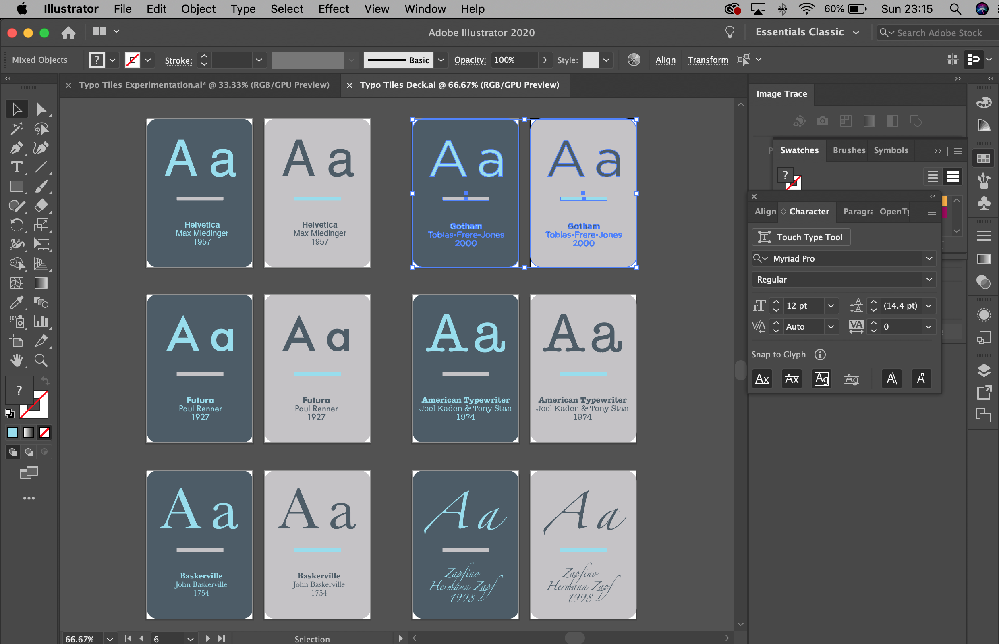

# Typo-tiles

Typo-tiles is a card matching game based on matching a selection of iconic typefaces. It's a short game designed to be fun and informative. 
As with any card-matching game, the idea is to match the two typefaces until all cards are matched.
Taking inspiration from
[The Type Kerning Game](https://type.method.ac/) and [Type War](http://typewar.com/), the game has been designed as a starter learning activity aimed primarily at students or anyone who wishes to learn more about typography. As well as the typeface sample 'A a' on each card, 
there is also a starting point of information for the player to use as a prompt or starting point for further research into each typeface. 

Typo-tiles has been created with HTML, CSS and Javascript. It is responsive on multiple screen sizes mobile, tablet and desktop. It's most effective to play on tablet screen sizes and above.

# UX

## User

Coming from a teaching background in graphic design, I always found it useful to start lessons with a game/starter activity to engage learners. 
With this in mind, I created 'Typo-tiles', specifically aimed at learners to act as a fun starter activity when learning about typography, typefaces and fonts. 
Although it is aimed at young adults, it can be applicable to anyone who wishes to access it as a typography learning resource.
Within the deck there can be a found a selection of pairs displaying some of the most iconic typefaces and font families/styles, 
allowing the user a strong starting point if they were to use the cards as an educational prompt for research. For learners who study graphic design, it is essential  
to build an awareness of typography and the fonts in the game. It's also important to be able to identify minor differences in similar typefaces. 
Therefore, some of the cards feature similar fonts to increase the challenge.

## User stories

1. As a user, I want to engage in a short game that provides fun and a sense of challenge.
2. As a user, I want to build familiarity with a range of iconic typeface samples and a short amount of information on each.
3. As a user, I may wish to make note of each typeface to research into further.
4. As a user, I want to be told what my score or rating is at the end of the game.
5. As a returning user, I want to be able to achieve a better score or rating next time.
6. As a user, I want to be able play a fluid game with a clean, appealing design aesthetic.
7. As a teacher, I would like to use the game as a quick starter activity to engage learners and introduce them to a range of funcdamental typefaces in graphic design.

## Scope

Based on the information gathered about the user and user stories, this project should include, a simple, fun game that's informative and responsive across devices. 
Users will expect a fluidity in the functionality of the game. A quick loading and game restart speed and professional presentation of the game. 

## Structure & Skeleton

For the game, the structure will be limited to a one-page site. It will include:

- A logo/title
- A deck of cards laid out in a grid, (I'll start by experiemnting with 16 cards and see what kind of grid is most appropriate).
- A timer, rating system and restart button
- A pop-up 'congratulations/completed' modal 

Users should expect a modern presentation of the game, therefore, I researched colour palette's on [Coolers](https://coolors.co/). 
I wanted the site to remain fairly neutral using greys, with a pop of brighter colour to liven it up. 

## Surface design

I started designing the wireframes with a clear vision of layout, typefaces, colour palette and features. To create the appearance of modern presentation, 
I want to:

- Add subtle gradient to create a slight sense of depth to the card board
- Add rounded edge's to to all shapes (cards & buttons)
- Include a smaple of the typeface on each card with a small amount of information beneath
- Keep the page layout simple, with minimal information. 
- Dependant on screen size, the game fit's to the size of the screen, changing the layout of the card deck, without losing resolution

# Wireframes, Mockups and Design

I developed a series of mockups, colour palettes and card designs in Adobe Illustrator.
Initially, I wanted to add more information to the cards, but I had to consider how to maintain the responsiveness on smaller screen sizes. 
After testing the mockup's at different screen sizes, I concluded that less information was more legible on smaller screens. 
 

# 

## Additional considerations for the game

Things I would do to improve: 
1. Add an additional row of pairs/progressive levels
2. Add local storage to preserve user personal scores to beat in the future
3. Add links to the flipped card - extra functionality

*use svg's to make it load quicker and not lose resolution

https://type.method.ac/ - The type kerning game, http://typewar.com/ - Type War

/* background CSS code taken from CSS Tricks: https://css-tricks.com/perfect-full-page-background-image/*/

Tech used:

Adobe Illustrator
Gitpod
HTML CSS Javascript
Google fonts
Font Awesome

