# Testing and Deployment

[Visit the Typo-tiles Game site here](https://roxjade.github.io/typo-tiles/)

# Contents

1. [Development and Problem Solving](#development-and-Problem-Solving)
2. [Testing for User Stories](#Testing-for-User-Stories)
3. [Responsiveness](#Responsiveness)
4. [Code Validators and Lighthouse](#Code-Validators-and-Lighthouse)
5. [Deployment](#Deployment)
6. [Browser Tests](#Browser-Tests)

# Development and Problem Solving

## Working with Javascript
At the start of the project I had the idea to create colour-mathing clickable tiles, using jQuery animation. After creating an experimental repository and playing around with this idea, I realised I had learnt a lot about how Javascript worked and the syntax, but I struggled to take it further and needed to go back to research.
Initially, I found Javascript very challenging and required a lot of additional research before I started to feel comfortable with the code. So I carried out a huge amount of research, reading, revisiting the course material on Code Institute and discussing ideas with my Mentor. Eventually, I settled on a typography-based card-matching game.
As I continued to use it to develop the game, I found it rewarding to learn and I'm exctied to continue to improve my skills in the future. 

## Issues in development

- **Had to change the card design for legibility:** After creating and styling the board, I looked at the front of the cards and realised I'd have to change the design slightly (images can be found in the [README.md Wireframes and Mockups](https://github.com/RoxJade/typo-tiles/blob/master/README.md#Wireframes-and-Mockups). This was to ensure legibility and responsiveness.

- **Double click issue:** After developing the flip card function I found a bug where the a double click on the same card registered as two matching flipped cards and remained flipped as they both shared the same '.data-typeface' class. For this I created a reset board function - which prevents the double click by resetting the first and second card properties to null.

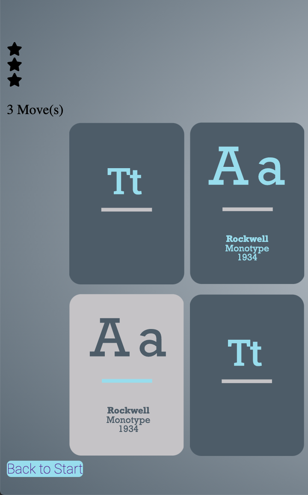
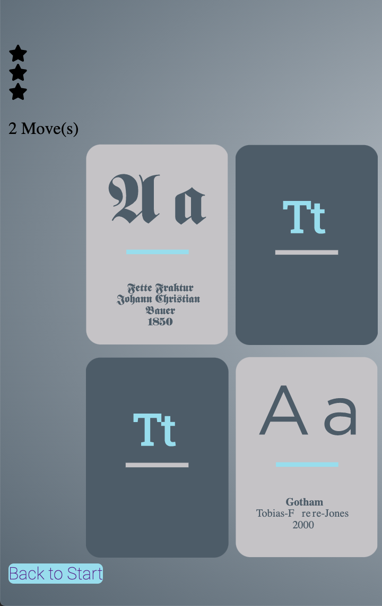

- **Star rating system too harsh:** After asking a friend to play through the game, I discovered that the star rating (linked to the move counter) was too low, so I increased these. 

- **I Found it hard to get the code right for the restart game button:** I spent a lot of time figuring out how to create the function to restart the game (linking to 'Back to start' button). I tried a couple of solutions creating functions that reset variables and remove event listeners but it wasn't working.
After research I created a location.reload(); function but I'm unsure if this is good practice.

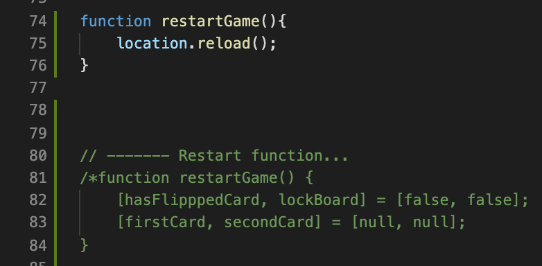

- **Background Issue:** I had trouble with the background of the page. I found that it was repeating. If I specified 'no-reapeat' in the styling, it was then cutting the background too short for the length of the page, even when I set it too 100% viewport height. 
After some research I found a handy article and some code on [CSS Tricks - perfect full page background](https://css-tricks.com/perfect-full-page-background-image/*/) to prevent the bug using 'cover' styling. 

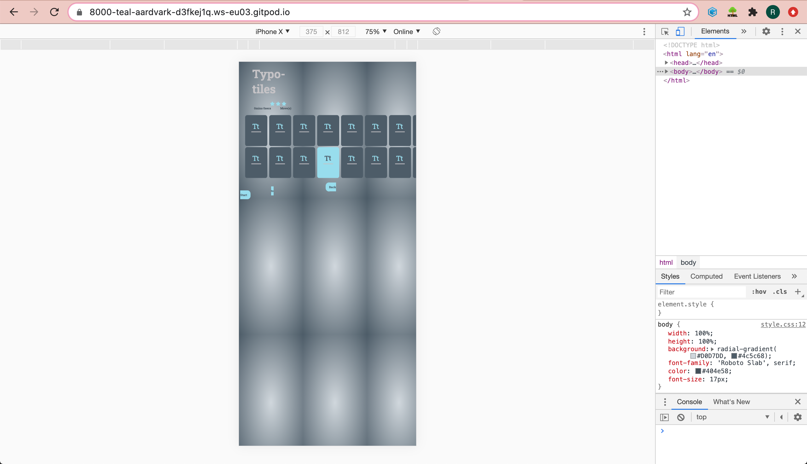
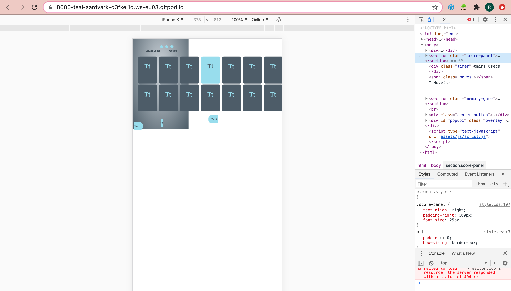

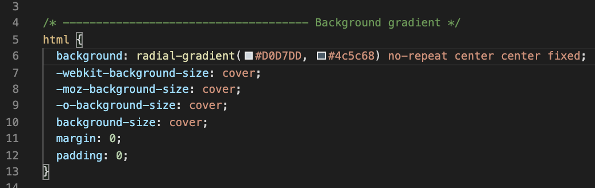
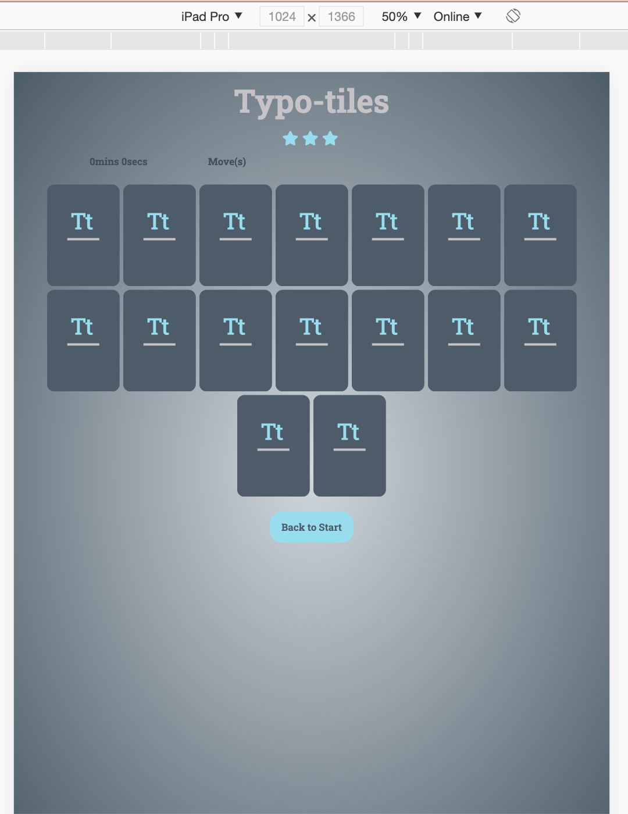

- **Media query issues:** Once the functionality was complete, I looked at responsiveness of the game and had to add more media queries than I would have liked. In future, I'd consider using Bootstrap columns and rows as I think it would help to reduce the amount of media queries and would probably be better practice for my CSS. 

# Testing for User Stories

User Stories can be found in [The README.md UX](https://github.com/RoxJade/typo-tiles/blob/master/README.md#UX)

1. As a user, I want to engage in a short game that provides fun and a sense of challenge.
    - As a user the game is short and fun to play. There is a sense of challenge provided by the timer, move counter and star rating.
2. As a user, I want to build familiarity with a range of iconic typeface samples and a short amount of information on each.
    - On each card pair the user will find an iconic typeface with a short bit information. As the user can replay the game, they can build up a familiarity with the typefaces.
3. As a user, I may wish to make note of each typeface to research into further.
    - On each card pair, the user can find an iconic typeface with enough information to research further.  
4. As a user, I want to be told what my score or rating is at the end of the game.
    - The user will find a pop-up modal with their moves, time and a star rating upon completion.
5. As a returning user, I want to be able to achieve a better score or rating next time.
    - The user can replay the game to try to beat their original times, moves and star rating. (In future, a local storage function should be included in the Javascript to aid this.) 
6. As a user, I want to be able play a fluid game with a clean, appealing design aesthetic.
    - User's should find the game fairly quick to load, the flip transition should be fluid and the site design has a minimal approach to aid the simplicity of the game.
7. As a teacher, I would like to use the game as a quick starter activity to engage learners and introduce them to a range of fundamental typefaces in graphic design.
    - As a teacher using the game as a lesson starter activity, the game should load well and be playable on large screen's.
    - It's short enough to create an engaging reaction from learners and introduces them to a range of relevant typefaces.

# Responsiveness

It took a lot of media queries to resolve the responsiveness of the site, see [Issues in development](#Issues-in-development) and [Restart game button breaks at larger screen size](#Restart-game-button-breaks-at-larger-screen-size) for issues with responsiveness at different stages. 
I tested the game on [Am I Responsive](http://ami.responsivedesign.is/). Although playable on mobile, it requires some scrolling around, therefore it is a more effective game to play on tablet screens and above. I couldn't avoid this as I needed to maintain card legibility. 

## Code Validators and Lighthouse

I used the code validators below and Lighthouse (Chrome Dev Tools):
- [Javascript Beautify Tools Validator](https://beautifytools.com/javascript-validator.php)
- [HTML W3 Validator](https://validator.w3.org/)
- [CSS W3 Validator](http://www.css-validator.org/)

## HTML Validator:

The HTML validator report gave 3 warnings. 2 issues with heading's not included in sections. I ignored these as I didnt need heading's in the specified sections. 
The other warned me:
1. There was no need to include a 'type' in my script page link at the bottom of the index.html page. So I removed this.

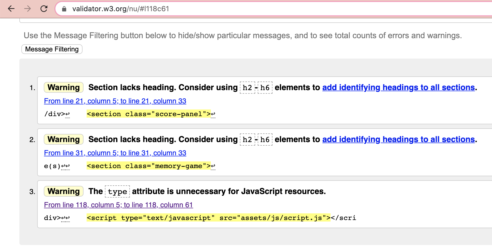

## CSS Validator

The CSS validator reported no errors, but 4 warnings:

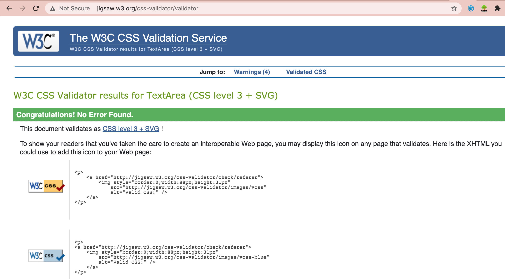
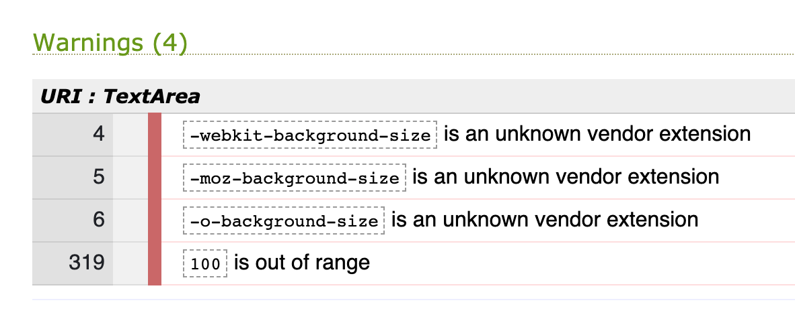

I ignored these as this was related to the code I used to solve my background bug earlier, [see Issues in the development process](##Issues-in-the-development-process).
After testing the CSS in another validator, it reported a warning for including @import directly into my style.css and is considered bad practice. I researched into this and found on [Stack Overflow - Use of @Import typeface](https://stackoverflow.com/questions/10036977/best-way-to-include-css-why-use-import#:~:text=From%20a%20page%20speed%20standpoint,stylesheet%20A%20contains%20the%20text%3A&text=If%20both%20stylesheets%20are%20always,them%20into%20a%20single%20file.) that it was better practice to include the link in the <head> of the index page.

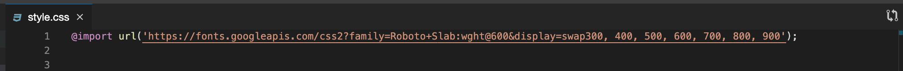

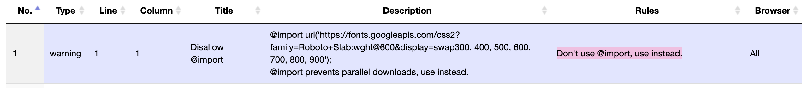

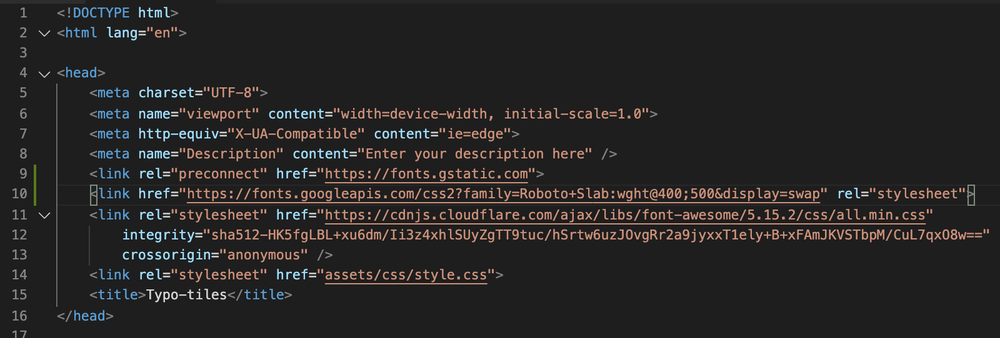

## Javascript Validator

The Javascript validator reported many issues, but the majority of these were aimed at the use 'let' and 'const' to declare variables. 
It also picked up on some semicolon issues, which I added/removed where necessary.

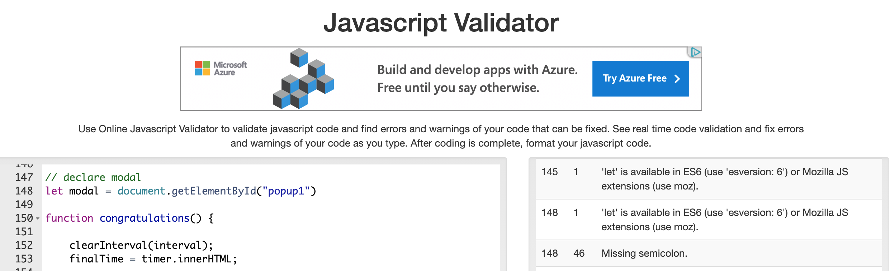
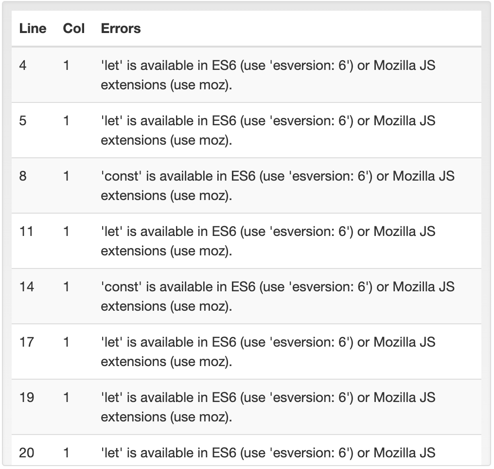

## Lighthouse

When tested on Lighthouse:

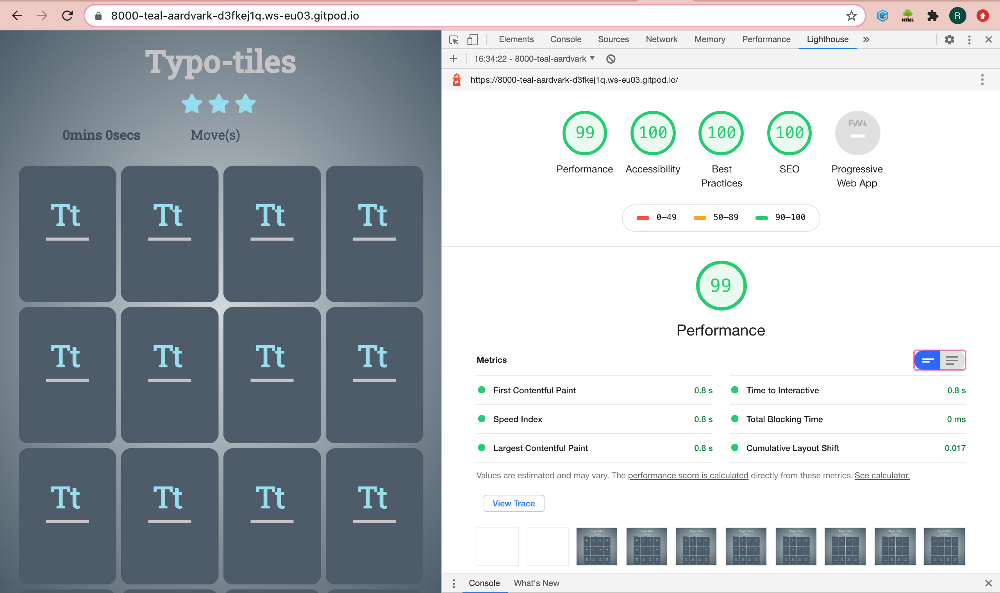

# Deployment 

I used Github to create the repository, Gitpod to code and Github to publish and host the site on Github pages. 

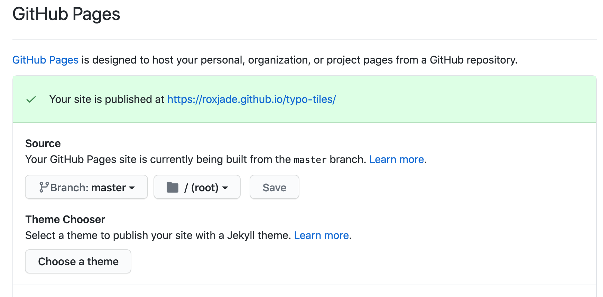

## Bugs discovered after deployment

On deployment I discovered two bugs:

## 1. The flip transition didn't work on Safari

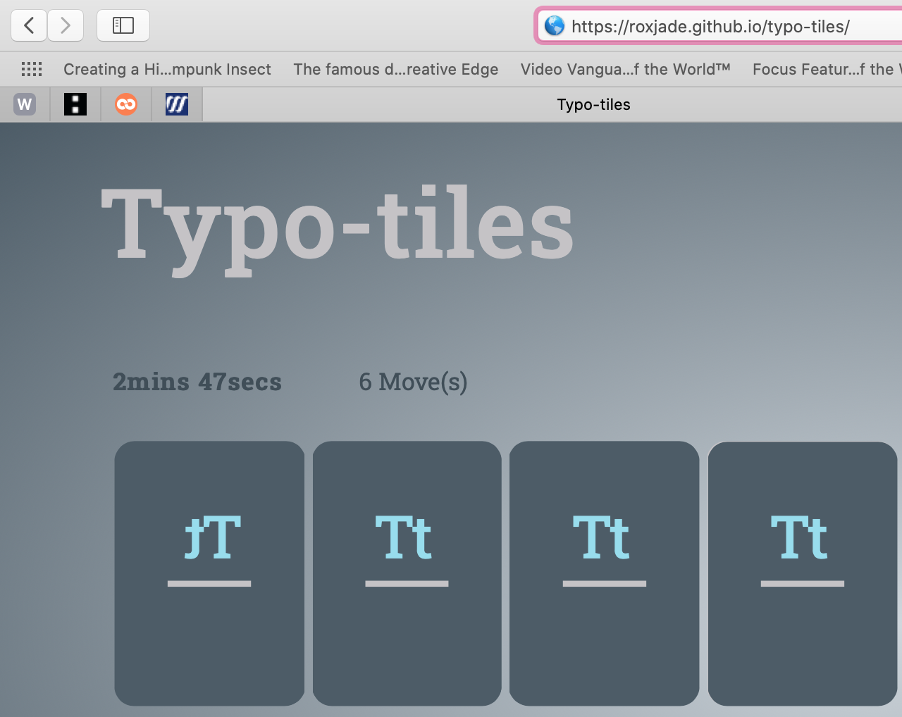

I fixed this by checking the CSS as I knew that I probably needed a prefix vendor on one/a few of the class styles that involved the 'flipcard' transition. 
I solved this by searching on [Can I Use](https://caniuse.com/) **image/screenshot and searching through the styles relevant to the flip transition, specifically:
- transform
- transform-style
- transition
- backface-visibility

I then added some vendor prefixes to the transform and backface-visibility. 
After waiting for the git commit and push to process, the flip transition worked fine on all browsers.

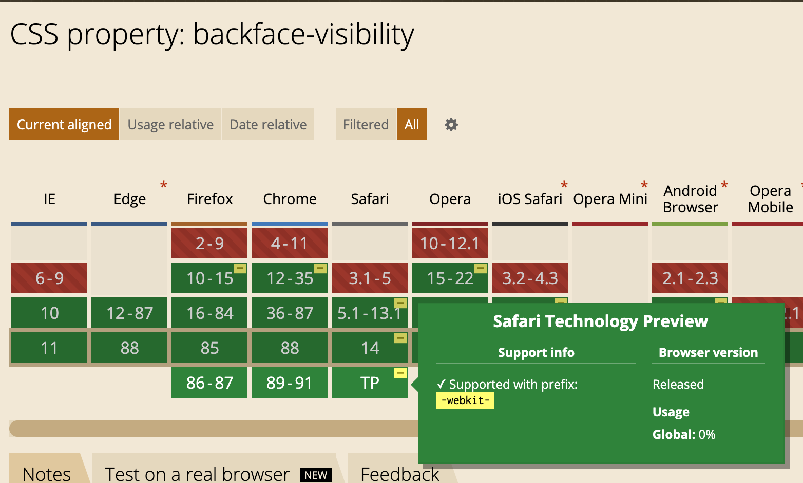

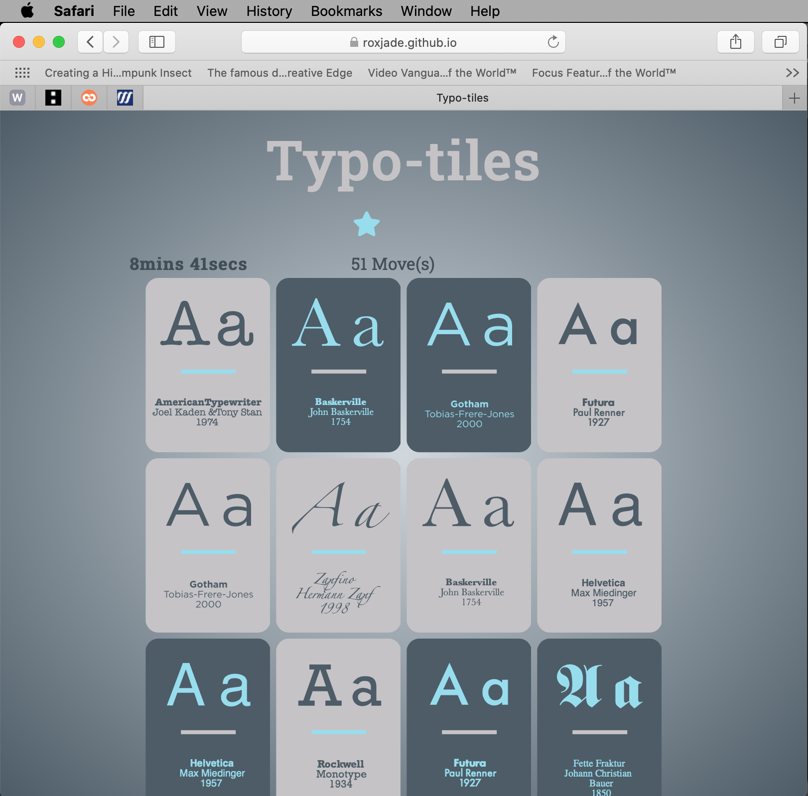

## 2. Restart game button breaks at larger screen size

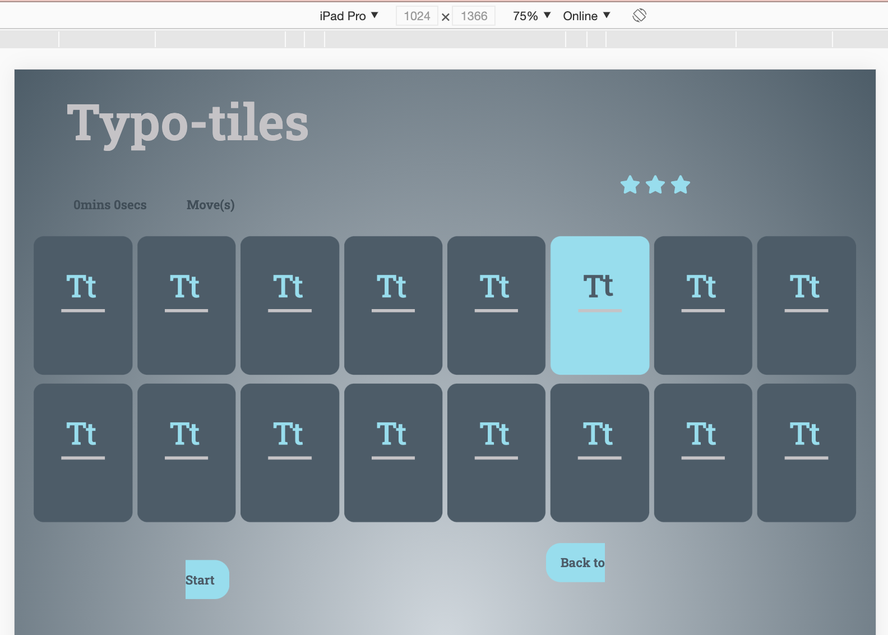

When re-sizing the browser window, I found an area on the site that wasn't responsive, that I hadn't previously picked up on. 
At screen width 1025 - 1142 (1143px and up was fine), the restart button breaks in half because of the margin added earlier to center the button.
** images **
I solved this by creating a media query for the specified screen width, removing the margins from the re-start button. 
In hindsight, I didn't need the margins on the restart button, I had initially used it to center the button, however, I later wrapped the button in a Footer and 
styled with center alignment (at this point I should have removed the margins).

# Browser Tests

After deployment, I tested the site on Safari, Firefox and Microsoft Edge. (I was already happy with it's functionality on Chrome as I had been using Chrome Dev Tools throughout development).
See above for the issue encountered when running the site on Safari: [The flip transition didn't work on Safari](##The-flip-transition-didn't-work-on-Safari).

Other than Safari, the site ran fine on the other two browsers (see examples):

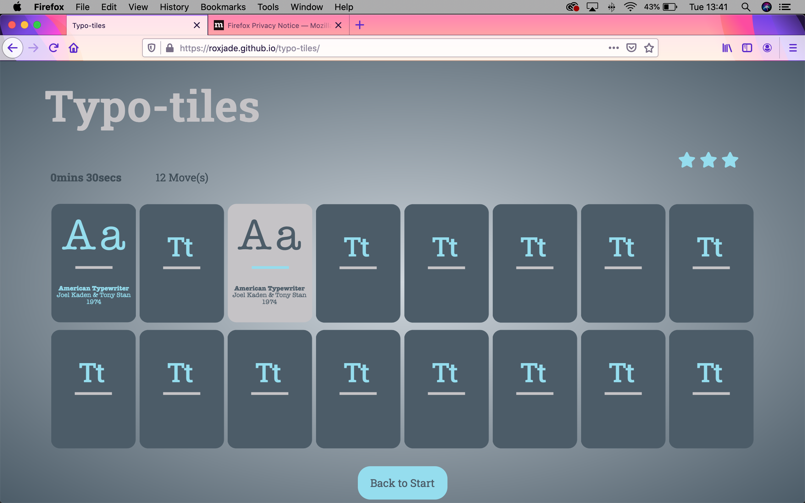
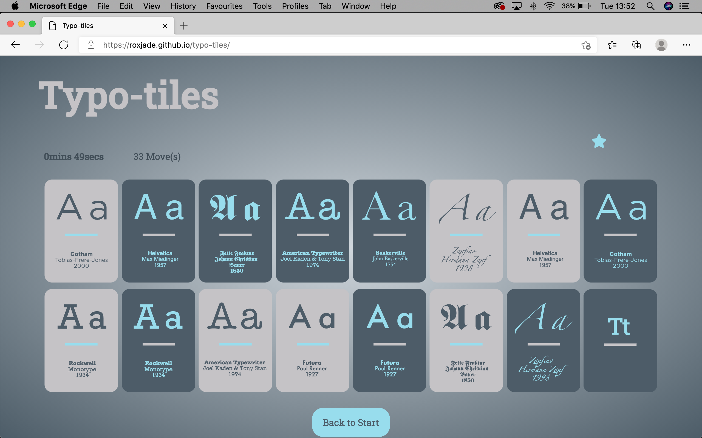